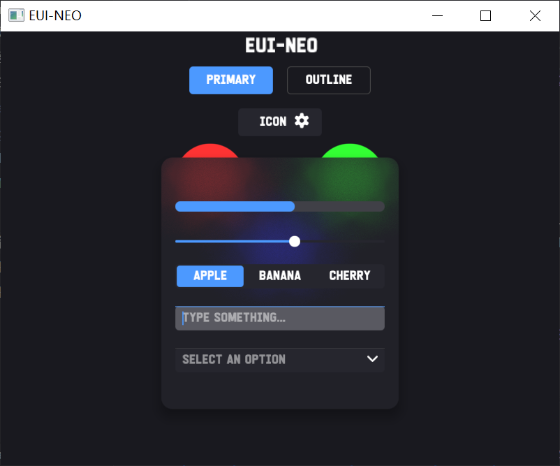
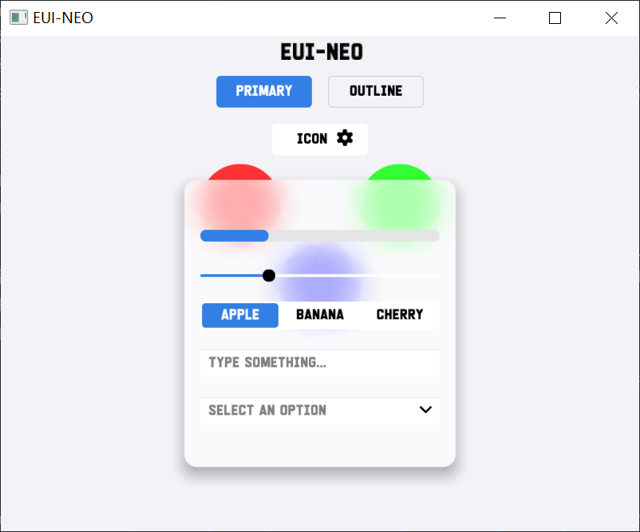

# EUI-NEO

EUI-NEO 是一个基于 OpenGL 的声明式 2D GUI 框架。当前版本的核心方向是：

- 页面层只写 `ui.begin()` 之后的链式声明。
- 组件定义收敛到 `src/components`，一个组件一个 `.h`。
- `UIContext` 只做节点生命周期和组合调度，不做每组件的专用分发。

<p align="center">
  
  
</p>

## 目录

```text
EUI-NEO/
├─ main.cpp
├─ README.md
├─ ui_dsl_analysis.md
├─ ui_dsl_guardrails.md
├─ src/
│  ├─ EUINEO.h
│  ├─ EUINEO.cpp
│  ├─ components/
│  │  ├─ Button.h
│  │  ├─ ComboBox.h
│  │  ├─ InputBox.h
│  │  ├─ Label.h
│  │  ├─ Panel.h
│  │  ├─ ProgressBar.h
│  │  ├─ SegmentedControl.h
│  │  ├─ Sidebar.h
│  │  ├─ Slider.h
│  │  └─ CustomNodeTemplate.h
│  ├─ pages/
│  │  ├─ MainPage.h
│  │  ├─ AnimationPage.h
│  │  └─ MainPageView.h
│  └─ ui/
│     ├─ UIBuilder.h
│     ├─ UIComponents.def
│     ├─ UIContext.h
│     ├─ UIContext.cpp
│     ├─ UINode.h
│     ├─ UIPrimitive.h
│     └─ UIPrimitive.cpp
└─ CMakeLists.txt
```

## 当前架构

- `main.cpp`
  负责窗口、输入、主循环和绘制驱动。
- `src/ui`
  负责 `UINode`、通用 builder、节点树、clip、primitive 几何和脏区工具。
- `src/components`
  每个组件自己定义 `Node / Builder / runtime state / update / draw`。
- `src/pages`
  页面按 header-only 方式组合组件。

当前内置组件：

- `panel`
- `glassPanel`
- `label`
- `button`
- `progress`
- `slider`
- `combo`
- `input`
- `segmented`
- `sidebar`

## 编译

```bash
cmake -B build -G Ninja
cmake --build build --config Release
```

## 运行方式

```cpp
EUINEO::MainPage mainPage{};

while (!glfwWindowShouldClose(window)) {
    mainPage.Update();

    if (EUINEO::Renderer::ShouldRepaint()) {
        EUINEO::Renderer::BeginFrame();
        mainPage.Draw();
    }
}
```

## 页面 DSL 示例

页面层的目标就是下面这种写法：

```cpp
ui.begin("main");

ui.sidebar("sidebar")
    .position(22.0f, 22.0f)
    .size(86.0f, State.screenH - 44.0f)
    .width(60.0f, 86.0f)
    .brand("EUI", "NEO")
    .item("\xef\x80\x95", "Home", [this] { SwitchView(MainPageView::Home); })
    .item("\xef\x81\x8b", "Animation", [this] { SwitchView(MainPageView::Animation); })
    .themeToggle([this] { ToggleTheme(); })
    .build();

ui.button("home.primary")
    .text("Primary")
    .position(220.0f, 84.0f)
    .style(EUINEO::ButtonStyle::Primary)
    .onClick([this] { progressValue_ += 0.1f; })
    .build();

ui.end();
```

真实示例见：

- `src/pages/MainPage.h`
- `src/pages/AnimationPage.h`

## 自定义组件接入

### 方式 1：直接用 `ui.node<T>()`

如果你只是自己写一个组件，不想再写一套专用 DSL 入口，直接用泛型节点入口：

```cpp
ui.node<EUINEO::TemplateCardNode>("stats.cpu")
    .position(120.0f, 80.0f)
    .size(220.0f, 96.0f)
    .call(&EUINEO::TemplateCardNode::setTitle, std::string("CPU"))
    .call(&EUINEO::TemplateCardNode::setValue, std::string("42%"))
    .call(&EUINEO::TemplateCardNode::setAccent, EUINEO::Color(0.30f, 0.65f, 1.0f, 1.0f))
    .build();
```

这个路径不需要改 `UIContext`。

### 方式 2：需要更顺手的 DSL 名字时，再注册别名

如果你希望最后写成 `ui.myCard("...")`，只需要在 `src/ui/UIComponents.def` 里补一行：

```cpp
EUI_UI_COMPONENT(myCard, MyCardNode)
```

这一步只是给 `UIContext` 增加一个别名函数，不应该引入：

- 专用 `switch`
- 专用 `map`
- 专用 `SyncXxx`
- 专用 `DrawXxx`
- 专用 `UpdateXxx`

## 组件开发守则

自定义组件现在遵循这套规则：

- 组件统一继承 `UINode`。
- 一个组件的 `Node / Builder / state / update / draw` 放在同一个 `.h`。
- 命中检测用 `PrimitiveContains(...)`。
- 绝对坐标用 `PrimitiveFrame(...)`。
- 视觉样式用 `MakeStyle(...)` 和 `ApplyOpacity(...)`。
- 局部刷新优先走 `MarkPrimitiveDirty(...)` 或手工 `Renderer::AddDirtyRect(...)`。
- 需要局部裁剪时用 `PrimitiveClipScope`。

### 通用 primitive helper

```cpp
RectFrame PrimitiveFrame(const UIPrimitive& primitive);
bool PrimitiveContains(const UIPrimitive& primitive, float x, float y);
RectStyle MakeStyle(const UIPrimitive& primitive);
Color ApplyOpacity(Color color, float opacity);
void MarkPrimitiveDirty(const UIPrimitive& primitive, const RectStyle& style,
                        float expand = 0.0f, float duration = 0.0f);
```

### 动画轨道

```cpp
using FloatAnimation = PropertyAnimation<float>;
using ColorAnimation = PropertyAnimation<Color>;
using GradientAnimation = PropertyAnimation<RectGradient>;
using TransformAnimation = PropertyAnimation<RectTransform>;
using RectStyleAnimation = PropertyAnimation<RectStyle>;
using RectFrameAnimation = PropertyAnimation<RectFrame>;
```

## 自定义组件模板

仓库里已经放了一个可复制模板：

- `src/components/CustomNodeTemplate.h`

这个模板刻意用 `ui.node<T>()` 路径，不强迫你先写专用 builder。适合先把组件做出来，后面再决定要不要注册 `ui.xxx()` 别名。

模板用法：

1. 复制 `src/components/CustomNodeTemplate.h`
2. 改类名和 `StaticTypeName()`
3. 按自己的业务改 setter、状态和 `draw()`
4. 页面里先直接用 `ui.node<YourNode>()`
5. 只有你真的想要 `ui.yourNode()` 时，再改 `UIComponents.def`

## 页面开发守则

- 一个页面尽量就是一个 `.h`。
- 页面里只保留状态、布局计算和 `ui.begin()/ui.end()` 之间的声明。
- 不在页面里回流到旧式控件实例管理。
- 不在页面里写每组件独立的绘制系统。

## 字体

```cpp
EUINEO::Renderer::LoadFont("font/your-font.ttf", 24.0f);
```

## 相关文档

- `ui_dsl_analysis.md`
- `ui_dsl_guardrails.md`

这两个文档约束的是同一件事：

- 新组件不应该迫使开发者去修改核心调度层。
- DSL 页面的目标是声明式组合
