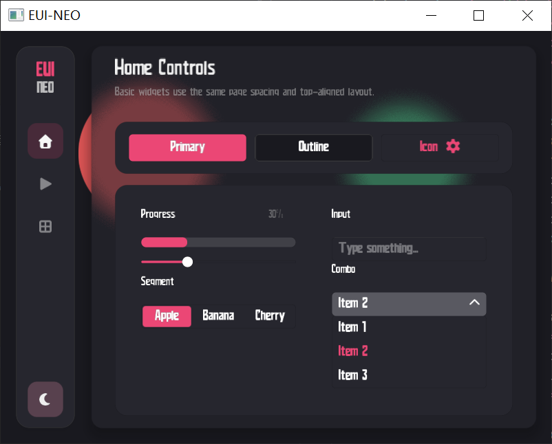
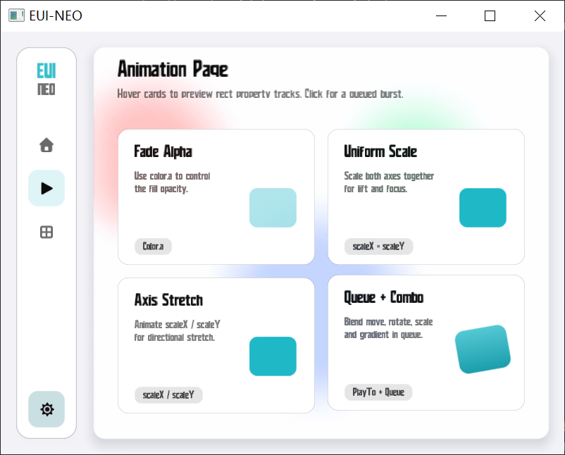

# EUI-NEO

EUI-NEO 是一个基于 OpenGL + GLFW 的声明式 2D GUI 框架。

- 页面放在 `src/pages`，尽量一页一个 `.h`
- 组件放在 `src/components`，尽量一个组件一个 `.h`

<p align="center">
  
  
</p>

## 目录

```text
EUI-NEO/
├─ main.cpp
├─ README.md
├─ docs/
│  ├─ ui_dsl_analysis.md
│  └─ gpui_full_redraw_optimization.md
├─ src/
│  ├─ EUINEO.h
│  ├─ EUINEO.cpp
│  ├─ components/
│  │  ├─ Button.h
│  │  ├─ ComboBox.h
│  │  ├─ CustomNodeTemplate.h
│  │  ├─ InputBox.h
│  │  ├─ Label.h
│  │  ├─ Panel.h
│  │  ├─ ProgressBar.h
│  │  ├─ SegmentedControl.h
│  │  ├─ Sidebar.h
│  │  └─ Slider.h
│  ├─ pages/
│  │  ├─ AnimationPage.h
│  │  ├─ HomePage.h
│  │  ├─ LayoutPage.h
│  │  ├─ MainPage.h
│  │  └─ MainPageView.h
│  ├─ ui/
│  │  ├─ UIBuilder.h
│  │  ├─ UIComponents.def
│  │  ├─ UIContext.cpp
│  │  ├─ UIContext.h
│  │  ├─ UINode.h
│  │  ├─ UIPrimitive.cpp
│  │  └─ UIPrimitive.h
│  └─ font/
│     ├─ Font Awesome 7 Free-Solid-900.otf
│     └─ Mountain and Nature.ttf
└─ CMakeLists.txt
```

## 当前演示页面

- `Home`
  - 基础控件页
  - 顶部按钮区 + 下方两列表单区
  - `Outline` 按钮会随机切换主题主色

- `Animation`
  - 自定义 `AnimationCardNode`
  - 演示 `Color / scale / rotation / gradient / queue` 动画轨道

- `Layout`
  - `row() / column() / flex()` 最小示例页
  - 一个滑条控制左右 `flex` 比例
  - 用来测试底层布局 DSL

## 编译

```bash
cmake -B build -G Ninja
cmake --build build --config Release
```

## 运行

入口在 `main.cpp`。主循环是事件驱动重绘：

```cpp
EUINEO::MainPage mainPage{};

while (!glfwWindowShouldClose(window)) {
    if (EUINEO::State.needsRepaint ||
        EUINEO::State.animationTimeLeft > 0.0f ||
        mainPage.WantsContinuousUpdate()) {
        mainPage.Update();
    }

    if (EUINEO::Renderer::ShouldRepaint()) {
        EUINEO::Renderer::BeginFrame();
        mainPage.Draw();
    }
}
```

## 页面写法

页面层目标是只写布局和声明，不回流到组件内部实现。

```cpp
ui.begin("main");

ui.sidebar("sidebar")
    .position(sidebarX, sidebarY)
    .size(sidebarWidth, sidebarHeight)
    .width(60.0f, 86.0f)
    .brand("EUI", "NEO")
    .selectedIndex(static_cast<int>(currentView_))
    .item("\xEF\x80\x95", "Home", [this] { SwitchView(MainPageView::Home); })
    .item("\xEF\x81\x8B", "Animation", [this] { SwitchView(MainPageView::Animation); })
    .item("\xEF\x80\x89", "Layout", [this] { SwitchView(MainPageView::Layout); })
    .themeToggle([this] { ToggleTheme(); })
    .build();

ComposeCurrentPage(PageBounds());

ui.end();
```

当前真实参考：

- `src/pages/MainPage.h`
- `src/pages/HomePage.h`
- `src/pages/AnimationPage.h`
- `src/pages/LayoutPage.h`

## Row / Column / Flex

现在底层已经有三种布局写法：

- `ui.row()`
- `ui.column()`
- `ui.flex()`

其中：

- `row()` 是横向排布
- `column()` 是纵向排布
- `flex()` 是通用弹性容器，靠 `.direction(...)` 选横向或纵向
- 子项用 `.flex(n)` 吃剩余空间

最简单示例：

```cpp
ui.column()
    .position(bounds.x, bounds.y)
    .size(bounds.width, bounds.height)
    .gap(16.0f)
    .content([&] {
        ui.row()
            .height(40.0f)
            .gap(12.0f)
            .content([&] {
                ui.button("a").flex(1.0f).text("A").build();
                ui.button("b").flex(1.0f).text("B").build();
            });

        ui.flex()
            .direction(EUINEO::FlexDirection::Row)
            .flex(1.0f)
            .gap(16.0f)
            .content([&] {
                ui.panel("left").flex(0.35f).build();
                ui.panel("right").flex(0.65f).build();
            });
    });
```

当前规则很简单：

- 主轴尺寸：固定尺寸优先，剩余空间交给 `.flex(n)`
- `column()` 子项默认横向撑满
- `row()` 子项默认保留自己的高度
- 需要容器内边距时直接 `.padding(...)`

## 当前锚点定位

现在这套锚点定位不是约束布局，也不是相对父容器自动排版；它本质上是：

- `9` 宫格屏幕锚点
- 组件自己的 `x / y / width / height`
- 再叠加当前上下文偏移 `contextOffsetX / contextOffsetY`

当前支持的锚点枚举：

- `TopLeft`
- `TopCenter`
- `TopRight`
- `CenterLeft`
- `Center`
- `CenterRight`
- `BottomLeft`
- `BottomCenter`
- `BottomRight`

默认锚点是 `TopLeft`。

实际计算规则在 `src/ui/UIPrimitive.cpp`，等价于：

```cpp
finalX = x + contextOffsetX + anchorOffsetX(screenW, width);
finalY = y + contextOffsetY + anchorOffsetY(screenH, height);
```

也就是：

- `TopLeft`：`x/y` 就是左上角绝对坐标
- `TopCenter`：先把组件放到屏幕顶部水平居中，再加 `x/y`
- `TopRight`：先贴到屏幕右上角，再加 `x/y`
- `Center`：先放到屏幕中心，再加 `x/y`
- `BottomRight`：先贴到屏幕右下角，再加 `x/y`

示例：

```cpp
ui.button("confirm")
    .size(160.0f, 44.0f)
    .anchor(EUINEO::Anchor::BottomRight)
    .position(-24.0f, -24.0f)
    .text("Confirm")
    .build();
```

这表示按钮先按右下角锚定到屏幕，再向左上回退 `24px`。

要注意两点：

- 这个锚点当前是基于 `State.screenW / State.screenH` 解析的，也就是基于屏幕，不是基于父面板局部宽高。
- `scrollArea`、`popup` 这类容器效果，本质上靠 `contextOffset + clip` 实现，不是新的锚点系统。

所以项目当前页面布局的真实写法仍然是“先手工算出区域 bounds，再把控件放进去”。例如：

- `MainPage` 先算 `sidebar` 和 `content` 区域
- `LayoutPage` 先算左右分栏宽度，再放组件
- 页面头部和 section 复用 `src/ui/ThemeTokens.h` 里的 helper

当前还没有：

- 相对父容器四边锚定
- 自动拉伸填充
- sibling 约束
- flex / grid / auto layout
- `left/top/right/bottom` 同时求解尺寸

## 自定义组件

推荐路径是先直接用 `ui.node<T>()`，不要一上来就改 `UIContext`。

```cpp
ui.node<EUINEO::TemplateCardNode>("stats.cpu")
    .position(120.0f, 80.0f)
    .size(220.0f, 96.0f)
    .call(&EUINEO::TemplateCardNode::setTitle, std::string("CPU"))
    .call(&EUINEO::TemplateCardNode::setValue, std::string("42%"))
    .call(&EUINEO::TemplateCardNode::setAccent, EUINEO::Color(0.30f, 0.65f, 1.0f, 1.0f))
    .build();
```

如果后面确实想写成 `ui.templateCard("...")`，再去 `src/ui/UIComponents.def` 注册别名：

```cpp
EUI_UI_COMPONENT(templateCard, TemplateCardNode)
```

可复制模板：

- `src/components/CustomNodeTemplate.h`

## 当前内置组件

- `panel`
- `glassPanel`
- `label`
- `button`
- `progress`
- `slider`
- `combo`
- `input`
- `segmented`
- `sidebar`

## 相关文档

- `docs/ui_dsl_analysis.md`
- `docs/gpui_full_redraw_optimization.md`
