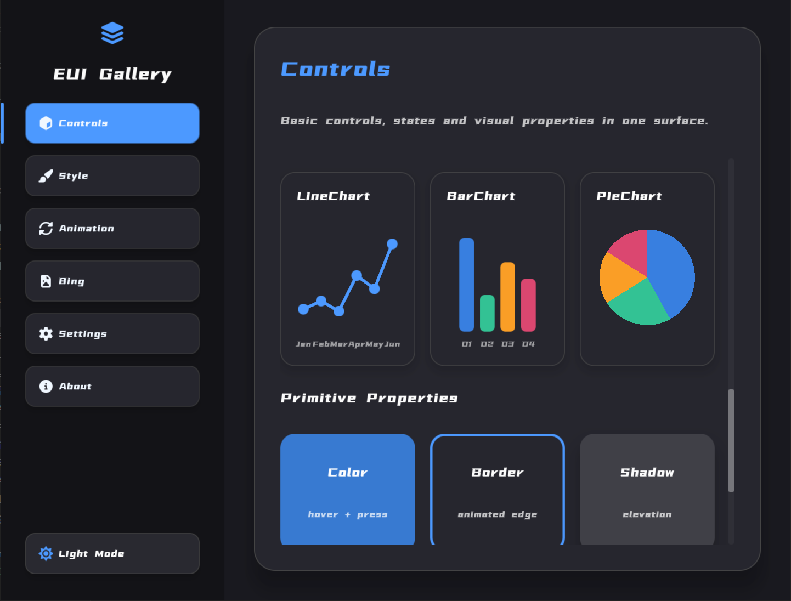
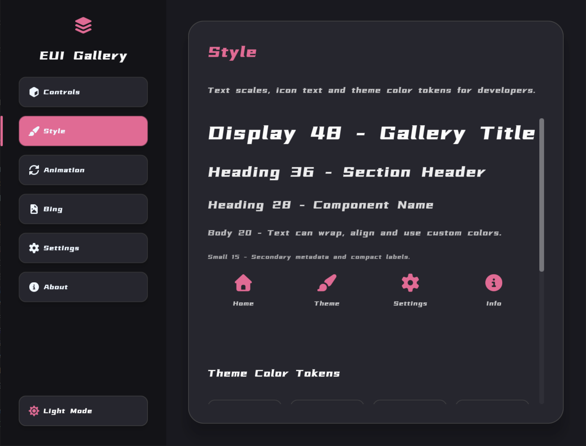
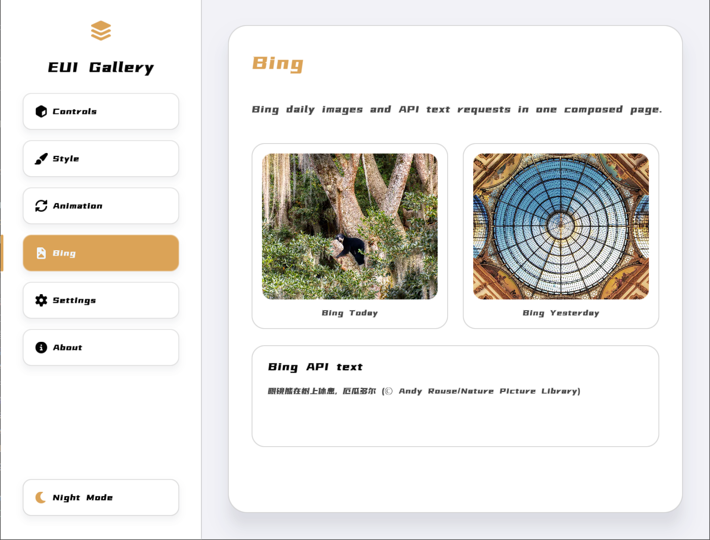
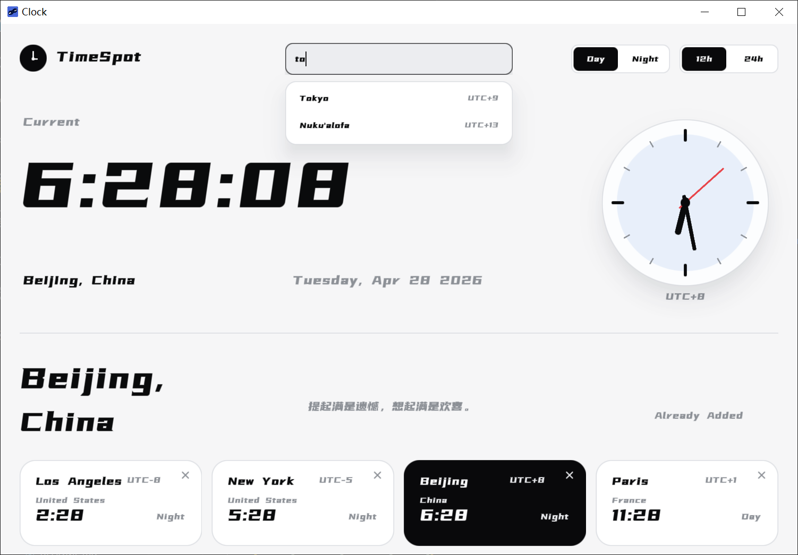

# EUI-NEO

<p align="center">
  
</p>

<p align="center">
  <a href="README.md">English</a>
</p>

EUI-NEO 是一个基于 C++17、OpenGL、GLFW 的声明式 UI 实验项目。页面通过 `core::dsl::Ui` 描述结构、样式、交互回调和目标状态，`core::dsl::Runtime` 负责布局、动画、事件、脏区渲染、framebuffer cache 和底层 primitive 同步。

## 预览

|  |  |
| --- | --- |
|  |  |
|  |  |
|  |  |

## 快速开始

环境要求：

- CMake 3.14+
- 支持 C++17 的编译器
- OpenGL
- 可访问网络时，CMake 会拉取 GLFW 和 glad

Windows / PowerShell 示例：

```powershell
cmake -S . -B build
cmake --build build --config Release
.\build\Release\gallery.exe
```

项目会为 `app/*.cpp` 下的每个页面源文件生成一个可执行程序，例如 `gallery` 和 `demo`。构建后会自动把 `assets/` 复制到可执行文件目录。

## 目录结构

```text
app/          页面入口和 gallery 示例
assets/       字体、PNG、SVG 和图标等运行资源
components/   基于 DSL 封装的通用组件
core/         DSL、Runtime、图元、文本、图片、网络和平台能力
docs/         项目实现文档
3rd/          第三方单文件依赖
```

## Docs

- [DSL 设计与当前实现](docs/DSL.md)
- [组件](docs/组件.md)
- [基础图元与文本图元](docs/基础图元文本图元.md)
- [布局](docs/布局.md)
- [事件](docs/事件.md)
- [动画](docs/动画.md)
- [渲染流程](docs/渲染流程.md)
- [图片](docs/图片.md)
- [网络](docs/网络.md)
- [窗口页面](docs/窗口页面.md)

## 当前组件

`components/components.h` 聚合导出当前组件层：

- 基础包装：`panel`、`text` / `label`、`image`、`theme`
- 控件：`button`、`checkbox`、`radio`、`toggleSwitch`、`progress`、`slider`、`input`、`segmented`、`tabs`、`scroll`
- 弹层和反馈：`dialog`、`toast`、`contextMenu`、`dropdown`
- 选择器：`datepicker`、`timepicker`、`colorpicker`
- 数据展示：`dataTable` / `datatable`
- 图表：`linechart` / `lineChart`、`barchart` / `barChart`、`piechart` / `pieChart`

组件只组合 DSL 树，不直接持有 OpenGL primitive。业务状态仍然放在页面或业务层，通过 builder 参数传入当前值，再从回调写回 next value。
